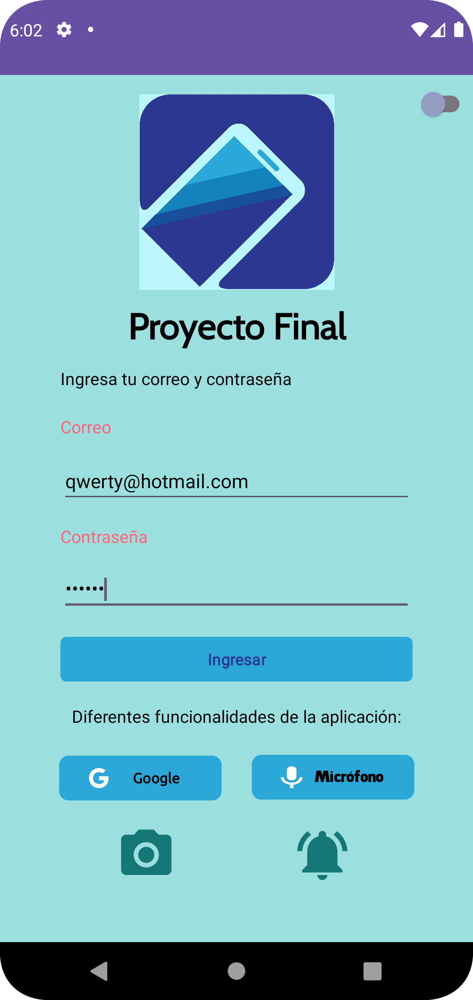

# Aplicación Proyecto Dispositivos Móviles

Aplicación de Android con distintas funcionalidades, principalmente hecha con la API de Marvel y la API Jikan.

## Características

Este proyecto de Android ofrece varias funcionalidades y características como:

- **Autenticación segura:** Implementa Firebase Authentication para permitir que los usuarios creen cuentas y se autentiquen mediante un correo electrónico y contraseña.

- **Carga de personajes de Marvel:** Obtiene una lista de personajes de Marvel desde la API de Marvel mismo, mostrando sus nombres, cómics e imágenes.

- **Explora los mejores animes:** Accede al top de animes más populares utilizando la API Jikan y muestra una lista de los animes mejor valorados en MyAnimeList.

- **Detalles de personajes:** Permite ver información detallada de un personaje o anime al hacer clic en su imagen. Muestra datos como el nombre, cómic relacionado y sinopsis en el caso de los animes.

- **Búsqueda y filtrado:** Utiliza un campo de búsqueda para filtrar la lista de personajes por nombre.

- **Modo oscuro:**Ofrece la opción de cambiar entre el modo claro y oscuro para adaptarse a las preferencias del usuario.

- **Permisos de ubicación:** Solicita y obtiene permiso para acceder a la ubicación del dispositivo.

- **Voz a texto:** Incorpora la capacidad de convertir voz en texto y realizar búsquedas en Google.

- **Autenticación biométrica:** Permite autenticarse utilizando huellas dactilares, lo que garantiza que solo el usuario pueda acceder a la aplicación y sus datos sensibles.

- **Cámara:** Utiliza la cámara del celular para tomar una foto y luego mostrarla.

- **Temporizador y notificaciones:** Configura recordatorios usando el temporizador para recibir notificaciones en momentos específicos.

- **Acciones rápidas:**Acceso rápido a las funcionalidades principales utilizando un menú en la parte inferior de la pantalla principal.

- **Carga eficiente de datos:** Utiliza Retrofit para realizar solicitudes a la API de Marvel y obtener datos actualizados. Almacena datos en una base de datos local con Room para una carga rápida y sin conexión.

- **ViewModel para la gestión de estados:**  Administra el estado y la lógica de la interfaz de usuario de manera eficiente, manteniendo una separación clara entre la lógica de presentación y la interacción del usuario.

- **Carga visual con Shimmer:** Brinda una experiencia de usuario más atractiva durante la carga de contenido.

## Capturas de Pantalla

### Modo claro

|  |  | | |
|----------|:-------------:|:-------------:|:-------------:

|  |  | | |
|----------|:-------------:|:-------------:|:-------------:

|  |  | | |
|----------|:-------------:|:-------------:|:-------------:

|  |  | |
|----------|:-------------:|:-------------:|

### Modo oscuro

|  |  | | |
|----------|:-------------:|:-------------:|:-------------:

|  |  | | |
|----------|:-------------:|:-------------:|:-------------:

|  |  | |
|----------|:-------------:|:-------------:|

## Librerías Utilizadas
**GIFs**
- `pl.droidsonroids.gif:android-gif-drawable:1.2.22`: Biblioteca que permite mostrar y animar imágenes GIF.
**Material Design**
- `com.google.android.material:material:1.9.0`: Ofrece componentes y estilos de diseño de Material Design.
**Constraint Layout**
- `androidx.constraintlayout:constraintlayout:2.1.4`: Permite crear diseños responsivos mediante la definición de restricciones entre elementos de la interfaz de usuario.
**Retrofit**
- `com.squareup.retrofit2:converter-gson:2.9.0`: Biblioteca para convertir respuestas de red JSON en objetos Kotlin/Java utilizando el formato Gson.
- `com.squareup.retrofit2:retrofit:2.9.0`: Biblioteca utilizada para realizar solicitudes de red HTTP de manera sencilla y eficiente en Android.
**Room**
- `androidx.room:room-common:2.5.2`: Biblioteca que simplifica el acceso a bases de datos SQLite en Android y permite escribir consultas SQL utilizando métodos Kotlin.
- `androidx.room:room-runtime:2.5.2`: Biblioteca que proporciona una capa de abstracción sobre SQLite para el manejo de bases de datos locales en Android.
- `androidx.room:room-compiler:2.5.2`: Biblioteca para generar código en tiempo de compilación necesario para el uso de Room en la aplicación.
**Picasso**
- `com.squareup.picasso:picasso:2.8`: Biblioteca para cargar y mostrar imágenes de manera eficiente en las vistas de Android.
**SwipeRefreshLayout**
- `androidx.swiperefreshlayout:swiperefreshlayout:1.1.0`: Componente que agrega la funcionalidad de arrastrar para actualizar en las vistas, como las listas y los fragmentos.
**Corrutinas**
- `org.jetbrains.kotlinx:kotlinx-coroutines-android:1.6.4`: Biblioteca para programación asincrónica y concurrente utilizando el lenguaje de programación Kotlin.
- `androidx.lifecycle:lifecycle-viewmodel-ktx:2.6.1`: Biblioteca para la creación y gestión de ViewModels en aplicaciones Android siguiendo el patrón de arquitectura ViewModel.
- `androidx.lifecycle:lifecycle-runtime-ktx:2.6.1`: Componente del ciclo de vida de Android para mantener el estado y la observabilidad de componentes de la interfaz de usuario.
- `androidx.lifecycle:lifecycle-livedata-ktx:2.6.1`: Biblioteca para la creación y observación de LiveData, que permite a las vistas reaccionar a los cambios en los datos.
**Ubicación**
- `com.google.android.gms:play-services-location:21.0.1`: Librería de Google Play Services para acceder a las capacidades de ubicación en Android, como la obtención de coordenadas GPS.
**View Models**
- `androidx.fragment:fragment-ktx:1.6.1`: Extensiones de Kotlin para trabajar con fragmentos en Android, facilitando la gestión del ciclo de vida y la navegación.
- `androidx.activity:activity-ktx:1.7.2`: Extensiones de Kotlin para simplificar la interacción con las actividades de Android, incluyendo la gestión del ciclo de vida.
**Biométrico**
- `androidx.biometric:biometric:1.2.0-alpha05`: Biblioteca para integrar la autenticación biométrica (huellas dactilares, reconocimiento facial, etc.) en aplicaciones Android.
**Shimmer**
- `com.facebook.shimmer:shimmer:0.1.0@aar`: Biblioteca que agrega efectos de brillo a las vistas para crear animaciones de carga atractivas.
**Firebase**
- `com.google.firebase:firebase-analytics-ktx`: Componente de Firebase que proporciona análisis y seguimiento del rendimiento de la aplicación.
- `com.google.firebase:firebase-auth-ktx`: Biblioteca de Firebase para la autenticación de usuarios, que ofrece métodos simplificados para administrar la autenticación.

## Instalación

1. Clona este repositorio: `git clone https://github.com/TuUsuario/TuRepositorio.git`
2. Abre el proyecto en Android Studio.
3. Ajusta la configuración de tu proyecto utilizando tu archivo `google-services.json` proporcionado por Firebase.
4. Compila y ejecuta la aplicación en un emulador o dispositivo.